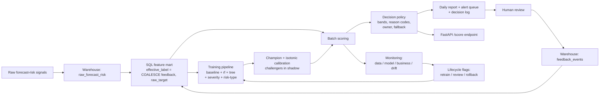

# Architecture

## Objective

Turn a forecast-risk model into an operational **decision support product** for
energy-market forecasting workflows, not just a binary risk classifier.

## End-to-end flow



## System components

### 1. Ingestion
- Raw forecast-risk signals land as CSV or service payloads.
- Warehouse loader validates schema and writes records to SQLite for the demo.
- Same loader can point at Postgres / Snowflake / BigQuery in a real deployment.

### 2. SQL feature mart
- Raw records are normalised into `feature_mart`.
- Feature mart adds date dimensions, a `data_health_score`, and the latest reviewer
  feedback via `COALESCE(reviewed_label, target_high_risk)` so that human corrections
  flow directly into the next training window.

### 3. Training pipeline
- **Binary classifier** for high-risk probability (baseline logreg + rf + tree).
- **Severity regressor** (ridge + rf + tree) for miss magnitude.
- **Multiclass classifier** for risk type (weather / ramp / model disagreement /
  calendar / data quality).
- Champion candidate is selected by utility and **calibrated with isotonic regression
  on the validation window** so the downstream `risk_score` is a probability.
- Challenger candidates are retained in the bundle and scored in shadow; see
  [`PROMOTION_POLICY.md`](PROMOTION_POLICY.md).

### 4. Decision / policy layer
- Converts model predictions into **risk bands** (Low/Medium/High/Critical) using a
  composite of probability and impact.
- Computes impact-weighted priority = `P(high) * severity * exposure`.
- Emits **business-readable reason codes** (RC01–RC10) instead of raw SHAP values.
- Invokes **fallback mode** under degraded inputs (missingness, latency, drift, source
  health, feature PSI) and switches to a rule-based score with transparent weights.

### 5. Monitoring service
- **Data**: missingness, latency p95, source-health rate, schema stability.
- **Model**: AUC, PR-AUC, Brier, severity RMSE/MAE.
- **Business**: alert precision by band, false-alert burden, escalated hit rate,
  analyst review load.
- **Drift**: PSI and KS per critical feature.
- **Lifecycle flags**: `trigger_retraining`, `review_now`.

### 6. Workflow integration
- Daily batch produces `daily_risk_table.csv`, `alert_queue.csv`, `decision_log.csv`,
  `monitoring_summary.json`, and a markdown `report.md`.
- Alert queue feeds analyst / forecast-ops lead review.
- Feedback from reviewers is captured back into `feedback_events` and flows into the
  next feature-mart build.

### 7. Serving
- **FastAPI** `/score` endpoint for synchronous scoring.
- **CLI** (`yes_forecast_risk.cli`) for batch and end-to-end demo execution.
- Dockerfile provided for reproducible packaging.

## Decision path

```text
Raw signals
  -> feature mart
  -> model inference (calibrated champion + shadow challengers)
  -> decision policy (bands, reason codes, owner, fallback if degraded)
  -> alert queue / daily report
  -> human review
  -> feedback events
  -> next training window
```

## Why this is senior-level rather than notebook-level

- Separates model scoring from business action logic.
- Provides a rule-based fallback for degraded operational conditions.
- Calibrated probabilities, not raw classifier scores.
- Monitoring, governance, and review cadence are first-class.
- Human-in-the-loop feedback closes the loop back into training data.
- Cross-functional ownership and escalation flow are documented, not implied.
